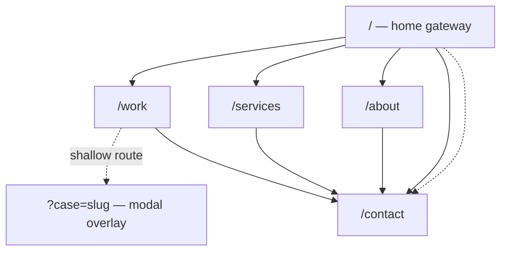

# PRD — Coffee Digital Website

**Status:** Approved blueprint, pre-implementation · **Last updated:** 2026-08-17

Sources of truth: [[brand/brand-audit|brand-audit]] · [[brand/palette|palette]] · [[reference/README|reference]]
Downstream: [[Design]] · [[architecture]] · [[pages/home|pages]] · [[TBD]]

> **Reading note.** This document states **requirements** — what must be true of the finished site. It deliberately avoids prescribing *how*. Implementation choices live in [[architecture]]; visual and motion choices live in [[Design]]. Where an implementation idea appears here it is marked *(implementation idea — not a requirement)*.

---

## 1. Product overview

A new marketing website for **Coffee Digital**, a digital agency that designs and builds websites and digital experiences for other companies.

Four pages — `/work`, `/services`, `/about`, `/contact` — plus a home gateway, global navigation, and a global footer. Small information architecture, high interaction quality.

## 2. Problem

Coffee Digital's current site (`coffeedigital.in`) undersells the agency badly.

| Evidence | Consequence |
|---|---|
| Content dates to ~2015 (catalogue years "AW 2015", "SS 2014") | Reads as dormant |
| **The awards are entirely absent** — Cannes, Webby, D&AD, One Show, Goafest | The single strongest differentiator is invisible |
| Shows ~10 projects; the deck holds 28 | Understates scale |
| Big-name clients — Google, Emirates, Lenovo, Motorola, J&J, Abbott — are not shown | No credibility anchor |
| No responsive strategy, `user-scalable=no` | Fails on mobile and blocks pinch-zoom, an accessibility violation |

Meanwhile the credentials deck contains everything the site is missing but is a 35-slide PowerPoint — it can only be emailed, never found.

**The problem in one line:** an agency that sells digital craft is represented by a site that demonstrates none, while its proof sits locked in a PowerPoint.

## 3. Objective

Ship a site that is *itself* the strongest work in the portfolio — where the craft of the site is the argument for hiring them — while presenting the awards and client roster as first-class, verifiable content.

## 4. Target audience

| Audience | Arrives asking | Needs |
|---|---|---|
| **Primary — marketing decision-makers** (CMO, brand/digital lead at a mid-to-large brand) | "Can they handle work at our level?" | Recognisable clients, category credibility, a way to start a conversation |
| **Secondary — agency & procurement intermediaries** | "Are they legitimate and awarded?" | Verifiable awards, live project links, a real contact route |
| **Tertiary — prospective hires** | "Is this somewhere good to work?" | Evidence of craft; a careers signal |

Note: awards and jury seats matter to audiences 2 and 3 far more than to audience 1. They must be prominent but must not displace the work.

## 5. Business goals

| # | Goal | Measured by |
|---|---|---|
| B1 | Generate qualified inbound enquiries | Form submissions with a budget band selected |
| B2 | Make the agency's calibre legible in under 30 seconds | Scroll depth past the proof section; time-to-first-interaction |
| B3 | Retire the PowerPoint as the primary credentials artefact | A shareable URL exists for every deck claim |
| B4 | Demonstrate capability through the artefact itself | Qualitative; design-award submission is a stretch goal |

## 6. User goals

- Understand what Coffee Digital does, in one screen
- See who they have worked for, without hunting
- Judge quality by seeing actual work, and reach the live sites
- Contact them without friction, from any page
- Do all of the above on a phone, on a mediocre connection

## 7. Brand positioning

**Confirmed tagline:** *"the digital branding people"* (legacy site)
**Confirmed positioning:** *"your full-stack digital partner — combining creativity, code, and strategy"* (deck)

**Voice: the legacy site's register is adopted** — lowercase, first-person, wry, confident without being corporate. It is more distinctive than the deck's title-case voice, and it is genuinely theirs.

> *Requires client sign-off — see [[TBD]].* If rejected, the deck register is the fallback and every page spec's copy needs revisiting.

**What we are not:** a SaaS landing page, a template, a Trionn clone. See [[reference/trionn/notes#Where we must be actively different]].

## 8. Scope

### In scope

- Home gateway, `/work`, `/services`, `/about`, `/contact`
- Global navigation and footer
- Case-study **modal** on `/work` with shareable shallow-routed URLs
- Enquiry form with delivery, validation, and spam protection
- Full motion system with a reduced-motion equivalent
- Asset pipeline for 28 projects
- SEO metadata, sitemap, robots, structured data
- Cookieless analytics

### Non-goals — explicitly excluded

| Excluded | Why |
|---|---|
| Blog / journal / news | No content to publish and no author to maintain it |
| Careers page | The "3C's" line is one paragraph. It becomes an `/about` section |
| Team page | No team photography, headcount, or bios exist |
| Testimonials | **None exist.** Fabricating them is out of the question |
| Pricing | Agency work is quoted, not listed |
| Process / methodology page | Nothing in the sources describes a process |
| Awards page | Awards are a section of `/about`, not a destination |
| Case-study detail **routes** | Locked decision: modal with shallow routing |
| CMS | 28 fixed projects. Typed static content instead |
| Multi-language | No requirement stated |
| Dark mode | The Roast Ramp is a light-mode concept |
| WebGL / three.js | See [[reference/trionn/notes#The single most valuable finding]] |
| User accounts, e-commerce, client portal | Not a requirement |

## 9. Sitemap

Four routes, one modal state. No nesting, no dead ends — every page terminates in a route to `/contact`.

## 10. Page requirements

Full specs in [[pages/home|home]] · [[pages/work|work]] · [[pages/services|services]] · [[pages/about|about]] · [[pages/contact|contact]] · [[pages/navigation|navigation]] · [[pages/footer|footer]].

| Page | Must do | Must not do |
|---|---|---|
| Home | Establish identity; route to all four pages; show proof; offer one contact path | Become a fifth content page. Every section defers to its page |
| `/work` | Present 28 projects, filterable; open a case modal; link out to live sites where honest | Present a Tier-B live capture as our work. Invent metrics |
| `/services` | Present three confirmed pillars and twelve items | Invent pricing, packages, timelines, or a process |
| `/about` | Lead with awards; state positioning; carry the careers line | Invent founding year, headcount, or location |
| `/contact` | Deliver an enquiry reliably; show confirmed emails; degrade to mailto | Render empty slots for missing phone/address/social |

## 11. Functional requirements

| ID | Requirement | Priority |
|---|---|---|
| F1 | All four pages plus home render as static HTML with no client JS required for content | Must |
| F2 | `/work` filters projects by discipline without a page reload | Must |
| F3 | Opening a case updates the URL to a shareable, shallow-routed state | Must |
| F4 | A shared case URL loads `/work` with that case open | Must |
| F5 | The case modal is dismissible by ✕, `Esc`, backdrop click, and Back | Must |
| F6 | The enquiry form validates inline and preserves input on error | Must |
| F7 | The form delivers to a Coffee Digital inbox and confirms in-page | Must |
| F8 | The form resists automated spam without a third-party consent surface | Must |
| F9 | Project data is typed and schema-validated at build; an invalid record fails the build | Must |
| F10 | Components for phone, address, and socials render **only when data exists** | Must |
| F11 | Outbound links to live client sites use `rel="noopener"` and are marked as external | Should |
| F12 | 404 renders in-brand with a route home | Should |

## 12. Interaction requirements

| ID | Requirement |
|---|---|
| I1 | Smooth scrolling site-wide, cancellable by `prefers-reduced-motion` |
| I2 | Navigation reachable from any scroll depth on every page |
| I3 | Every interactive element has visible hover, focus-visible, and active states |
| I4 | Page transitions preserve scroll intent and never trap focus |
| I5 | No interaction depends on hover alone — every hover affordance has a tap/focus equivalent |
| I6 | No interaction depends on a custom cursor; it is decorative only |
| I7 | Filtering and modal state are keyboard-operable end to end |

## 13. Motion requirements

Vocabulary and values in [[Design]]. These are the constraints motion must satisfy.

| ID | Requirement |
|---|---|
| M1 | **Every animation has a stated purpose.** Decorative-only motion is rejected at review |
| M2 | Motion never gates content — text is readable and links usable if animation never runs |
| M3 | `prefers-reduced-motion: reduce` yields a complete, usable site: no smooth-scroll hijack, no scroll-linked movement, transitions ≤120ms opacity only |
| M4 | Animation runs on transform and opacity only |
| M5 | Scroll-linked motion holds 60fps on a mid-range 2021 Android |
| M6 | Mobile **replaces** desktop-only techniques (pinning, horizontal scroll) rather than shrinking them |
| M7 | No animation blocks first paint of primary content |
| M8 | Motion is interruptible — scrolling away mid-animation must never leave a stuck state |

## 14. Accessibility requirements

Target: **WCAG 2.1 AA**.

| ID | Requirement |
|---|---|
| A1 | Body text meets 4.5:1; large text and UI boundaries meet 3:1. Measured values in [[brand/palette#3 Measured contrast]] |
| A2 | **`--heat` `#F62440` is never used for body text** — it reaches AA-large only |
| A3 | Full keyboard operability; visible focus that meets 3:1 against every ground |
| A4 | One `<h1>` per page; heading levels never skip |
| A5 | Landmarks: `header`, `nav`, `main`, `footer` |
| A6 | Modal traps focus while open and restores it to the trigger on close |
| A7 | Meaningful images carry alt text; decorative ones are hidden from AT |
| A8 | **Pinch-zoom is never disabled** — an explicit correction of the legacy site |
| A9 | Filter and modal state changes are announced to assistive technology |
| A10 | Target size ≥44×44px on touch |
| A11 | Site is usable with JavaScript disabled — content readable, links followable |

## 15. Responsive requirements

| ID | Requirement |
|---|---|
| R1 | Designed at three tiers — mobile, tablet, desktop — as distinct compositions, not one scaled |
| R2 | No horizontal overflow at any width from 320px up |
| R3 | Touch targets and spacing tuned per tier |
| R4 | Every scroll-driven interaction has a documented per-tier behaviour |
| R5 | Images ship responsive sources; no desktop asset is served to a phone |
| R6 | Layout survives 200% browser zoom |

## 16. Performance requirements

Motion-heavy is not licence to be heavy.

| Metric | Target | Ceiling |
|---|---|---|
| Lighthouse Performance (mobile) | ≥90 | ≥85 |
| Lighthouse Accessibility | 100 | ≥95 |
| Lighthouse Best Practices / SEO | ≥95 | ≥90 |
| LCP (mid-range Android, 4G) | <2.0s | <2.5s |
| INP | <150ms | <200ms |
| CLS | <0.05 | <0.1 |
| **Initial JS, gzipped** | **<140KB** | **<180KB** |
| Largest single image | <200KB | <300KB |
| Web font payload | <120KB | <160KB |
| Scroll frame rate, mid-range mobile | 60fps | ≥50fps |

| ID | Requirement |
|---|---|
| P1 | Animation libraries load only where used, never in the global bundle |
| P2 | Images: modern formats, responsive sizes, lazy below the fold, explicit dimensions |
| P3 | Fonts self-hosted, preloaded, `font-display: swap`, subset to used ranges |
| P4 | Below-fold and modal content code-split |
| P5 | Third-party scripts: **zero**, other than analytics |
| P6 | Budgets enforced in CI — a regression fails the build |

## 17. SEO requirements

| ID | Requirement |
|---|---|
| S1 | Unique title and meta description per page |
| S2 | OG and Twitter card metadata; per-page OG images |
| S3 | `Organization` structured data. `LocalBusiness` **only if** an address is supplied — see [[TBD]] |
| S4 | `sitemap.xml` and `robots.txt` |
| S5 | Canonical URLs |
| S6 | Content present in server-rendered HTML, not injected client-side |
| S7 | Semantic headings carrying real keywords, not styling hooks |
| S8 | Descriptive alt text on project imagery |
| S9 | **No keywords meta tag** — obsolete |

## 18. Analytics requirements

| ID | Requirement |
|---|---|
| N1 | **Cookieless.** No consent banner shall be required |
| N2 | Track: page views, enquiry submissions, case-modal opens, outbound live-site clicks, filter use |
| N3 | No personal data leaves the site beyond form delivery |
| N4 | Analytics must not appear in the critical rendering path |

## 19. Success criteria

**Launch gate — all must pass:**

1. Every performance target in §16 met on a throttled mobile profile
2. Zero WCAG AA failures in automated testing plus a manual keyboard pass
3. Every claim on the site traces to [[brand/brand-audit#✅ Confirmed]] or is marked Proposed
4. All three ⛔ blockers in [[TBD]] resolved
5. The site is fully usable with `prefers-reduced-motion` enabled and with JS disabled
6. The comparison test passes: with logos removed, our pages are not confusable with the reference

**Post-launch:**

7. Qualified enquiries arriving through the form
8. Awards and client roster discoverable within 30 seconds of landing

## 20. Risks

| Risk | Impact | Likelihood | Mitigation |
|---|---|---|---|
| **Client logo rights not granted** | Severe — guts `/work` and the proof section | Medium | ⛔ Blocker in [[TBD]]. Fallback: name clients in text, drop the marks |
| **Awards superlative challenged** | Legal/ASCI exposure | Low–Medium | ⛔ Blocker. Fallback: list the awards, drop the superlative |
| **Tier-B sites since redesigned** | Misrepresentation | **High** | Tiering in [[pages/work]]; no live capture presented as ours without confirmation |
| Motion budget breached late | Performance failure at the end | Medium | Budgets in CI from the first commit |
| Voice decision reversed after copy is written | Rework across all specs | Medium | Flagged early; copy kept in content modules, not components |
| Low-resolution deck imagery | Cheap-looking `/work` | Medium | Tier-A re-capture; art direction that makes softness deliberate |
| Site reads as derivative | Reputational — for a design agency, fatal | Medium | Standing comparison test at every review |
| Scope drift toward a fifth page | Dilutes the concept | Medium | Non-goals in §8 are binding |

## 21. Open questions

Tracked with owners in [[TBD]]. The ones that change the work:

1. **⛔ Client logo usage rights** — governs `/work` and the proof section
2. **⛔ Basis for "most awarded in India"** — ships or is cut
3. **⛔ Which Tier-B sites are still Coffee Digital's build** — governs capture
4. **Voice** — legacy lowercase vs deck corporate. Affects every line of copy
5. **Phone, address, socials** — govern `/contact` and `LocalBusiness` schema
6. **Slide 14 discrepancy** — titled "Uncle Sams Kitchen", links `samskriti.in`
7. **Budget bands in ₹** — needed before the form ships
8. **Futura licence vs open substitute** — affects the type system

## 22. Future considerations

Deliberately deferred. Not commitments.

| Idea | Trigger |
|---|---|
| One OGL WebGL effect on work-tile hover | Only if the site is fast and a measurement shows benefit |
| Case studies with real narrative and outcomes | Only when the client supplies briefs and results |
| Dark mode | Only on request; needs its own ink and heat values re-derived |
| CMS | Only if project updates become frequent enough to justify it |
| Hindi/regional localisation | Only if a market need appears |
| A careers page | Only when there are real openings |
