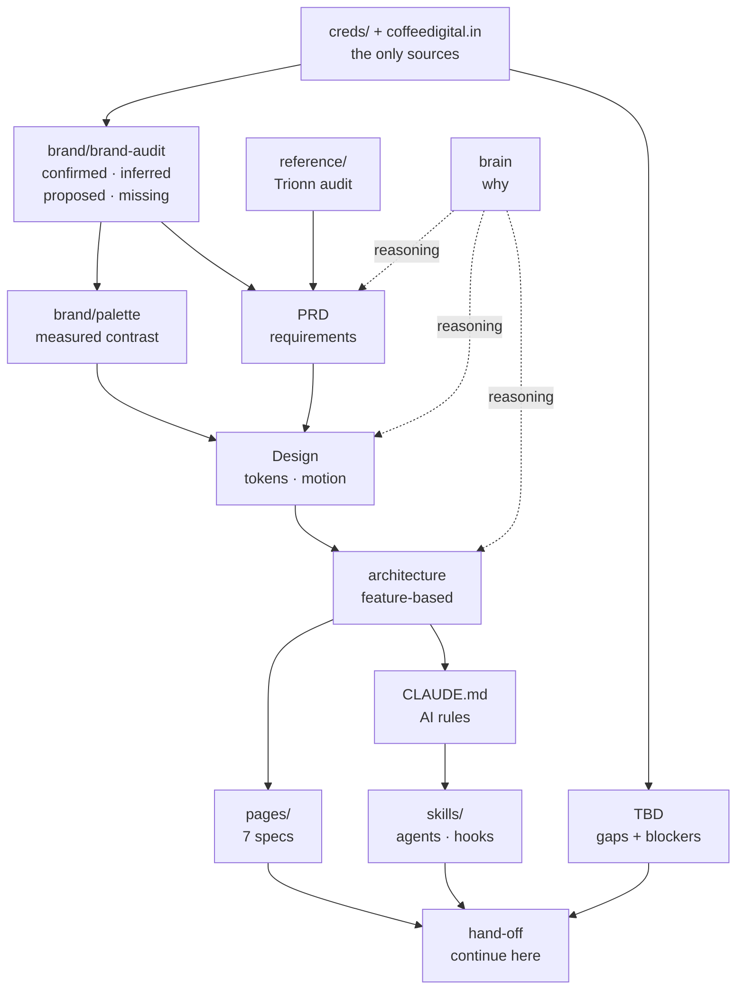

# Coffee Digital

Website for **Coffee Digital** — a digital agency that designs and builds websites and digital experiences for other companies.

Four pages, heavy scroll-driven motion, warm off-white ground. Next.js 15 · Tailwind v4 · GSAP · Lenis.

**Status:** blueprint complete, implementation not started → [[hand-off]]

---

## The one rule

> **Nothing about Coffee Digital may be invented.**
>
> Every factual claim traces to [[brand/brand-audit#✅ Confirmed|brand-audit → Confirmed]]. No founding year, no headcount, no location, no project metrics, no testimonials — **none of these exist in any source.** If a section feels thin without them, the section is wrong, not the facts.

Enforced mechanically by `.claude/hooks/guard-fabrication.mjs`.

---

## Documentation graph



## Read in this order

| # | Document | What it answers |
|---|---|---|
| 1 | [[brand/brand-audit\|brand/brand-audit]] | What is actually true about the client |
| 2 | [[brand/palette\|brand/palette]] | The locked colours, with measured contrast |
| 3 | [[reference/README\|reference/]] | What a peer studio ships, and what we won't copy |
| 4 | [[PRD]] | What must be true of the site |
| 5 | [[Design]] | Tokens, type, motion, responsive behaviour |
| 6 | [[architecture]] | How the code is organised |
| 7 | [[pages/home\|pages/]] | Every section, fully specified |
| 8 | [[CLAUDE\|CLAUDE.md]] | The rules for working here |
| 9 | [[brain]] | Why things are the way they are |
| 10 | [[TBD]] | What we still don't know |
| 11 | [[hand-off]] | How to continue |

## Structure

```
├── creds/          ⚠️ source deck + logo — gitignored
├── brand/          reconstructed SVGs, measured palette, source audit
├── reference/      Trionn audit + 37 screenshots
├── pages/          7 page specs — the implementation contract
├── skills/         agents, routing, MCPs, hooks, runbooks
├── .claude/        agent definitions, hooks, settings
└── src/            ⬜ not yet
```

## Quick facts

| | |
|---|---|
| Pages | `/work` `/services` `/about` `/contact` + home |
| Palette | `#FFFAF3` `#FFF2DB` `#FFE5BF` `#F62440` + `--ink` `#3F2210` |
| Type | Jost · Instrument Sans · Geist Mono — all open licence |
| Motion | GSAP + Lenis. Six primitives. **No WebGL** |
| Content | Typed static modules + Zod. **No CMS** |
| Projects | 28, tiered A/B/C by what the imagery can honestly claim |
| JS budget | <140KB gzipped |
| Blockers | ✅ None — all 3 resolved 2026-08-17, see [[TBD]] |

## Signature ideas

- **The Roast Ramp** — the page ground walks `#FFFAF3` → `#FFF2DB` → `#FFE5BF` as you scroll, light to warm, like a roast developing
- **The Stripe** — the 186-band coffee barcode found in the credentials deck, doing five structural jobs
- **The Bean** — the logo's half-filled counter as cursor and loader
- **Heat is rationed** — one `#F62440` element per viewport

## Working here

This is an Obsidian vault. Open the folder directly; internal links and the graph work as-is.

Rules for AI-assisted work are in [[CLAUDE|CLAUDE.md]] and fire automatically via [[skills/routing|skills/routing]]. Two hooks block design-system and fabrication violations at write time.

## Provenance

Client content comes from the credentials deck and `coffeedigital.in`. Reference research uses **publicly accessible sources only** — no authentication, paywall, or access control was bypassed. Archived third-party HTML is kept locally and gitignored.
