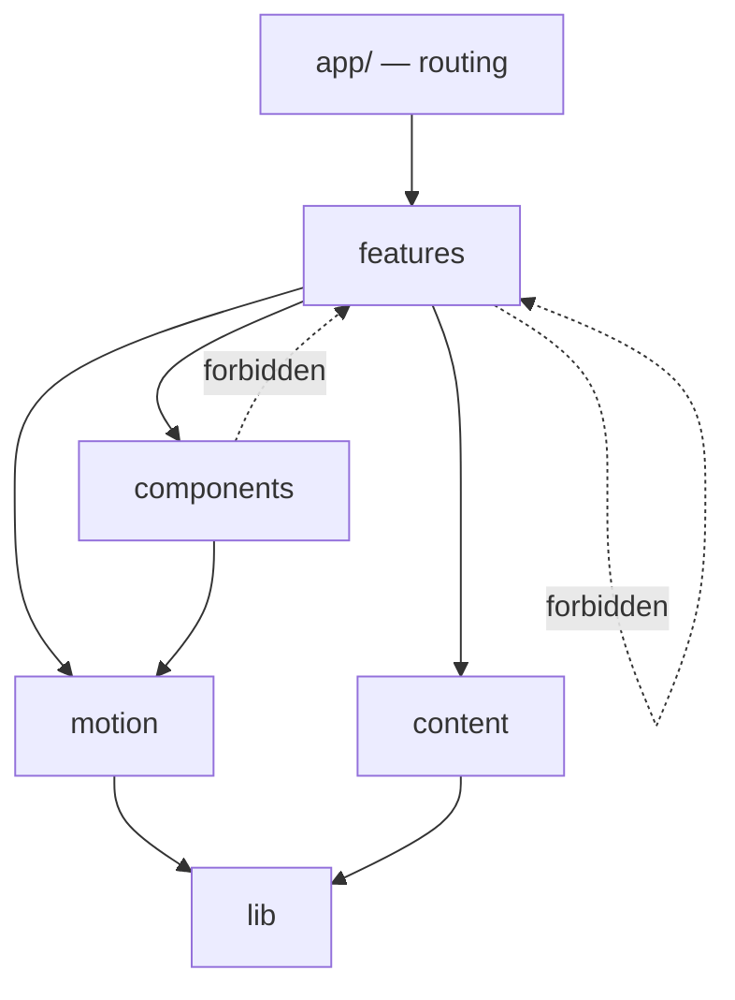

# Architecture

Feature-based application architecture for the Coffee Digital website.

Upstream: [[PRD]] · [[Design]] · [[reference/trionn/tech-stack|tech-stack]]
Downstream: [[CLAUDE]] · [[hand-off]]

> **The organising principle:** code is grouped by **what it is for**, not by what it is. A `ProjectFilter` lives with the work feature, not in a global `components/` bin with every other filter in the codebase.

---

## 1. Stack

| Layer | Choice | Rationale |
|---|---|---|
> **Verified against `package.json` on 2026-08-22.** This table is what is
> installed, not what was planned. Where the two used to differ it was the table
> that was wrong — see [[brain#D18 — WebGL is the home page, and D3 is superseded (2026-08-22)|brain D18]].

| Layer | Choice | Rationale |
|---|---|---|
| Framework | **Next.js 16.2, App Router** (Turbopack) | Four pages plus a home gateway, SEO-critical. SSG keeps the performance ceiling high |
| Language | **TypeScript, strict** | — |
| Styling | **Tailwind v4 + CSS custom properties** | Validated by research; matches global defaults |
| **3D / WebGL** | **three.js 0.180** | **The home page and the work carousel.** Adopted in practice, ratified in [[brain#D18 — WebGL is the home page, and D3 is superseded (2026-08-22)|D18]]. Raw three.js — no R3F, no Drei |
| Springs / UI motion | **@react-spring/web** + **spring-text-engine** | Every reveal, the rotating word, the scroll cue. Global `skipAnimation` is how reduced motion is honoured |
| Animation | **GSAP 3.15** | ⚠️ Now a **single** consumer — the staggered menu. See the note below |
| Smooth scroll | **Lenis** | RAF-driven |
| State | **Zustand** | Scroll store only (`hooks/smooth-scroll/use-scroll.ts`) |
| Validation | **Zod** | Build-time content validation |
| Email | **Resend** | ⚠️ **Specified, not installed.** `/api/contact` exists; the mail layer does not |
| Deploy | **Vercel** | |
| Analytics | **Vercel Analytics** or **Plausible** | Cookieless — no consent banner ([[PRD#18 Analytics requirements]]) |
| UI library | **None** | Hand-built primitives ([[Design#7 Components]]) |
| CMS | **None** | 28 fixed projects. Typed static modules |

⚠️ **Two animation runtimes are live.** The rule "one animation system, not two"
was written when GSAP was the only one; react-spring has since become the
dominant one and GSAP is down to a single import in
`use-staggered-menu.ts`. That is the reverse of the intended split and it is
tracked in [[TBD#S9|TBD S9]] — either finish the move to springs and drop GSAP,
or restate the rule. Do not add motion in a *third* way while this is open.

### Rejected, and why

| Rejected | Reason |
|---|---|
| **R3F / Drei** | The scene is written against raw three.js and does not need a reconciler. `@react-three/fiber` was installed but imported nowhere — removed 2026-08-22 |
| shadcn/ui, Radix, 21st.dev, OriginUI | Component-library defaults are the visual signature of templated design. Bespoke primitives are less code and more control |
| Sanity / Payload / Contentful | Fixed content, one editor, no publishing cadence. A CMS is a monthly bill for a problem we don't have |
| Framer Motion | Would be a third motion runtime alongside react-spring and GSAP |
| Redux / Jotai | Zustand already covers the only shared state (scroll) |
| reCAPTCHA | A third-party script and a consent surface. Honeypot + rate limit + timing check is sufficient here |
| **Vendored UI kits** | 2,713 lines of "originkit" hero code sat unreachable in `src/` until the 2026-08-22 cull ([[brain#D19 — The dead-code cull (2026-08-22)|D19]]). Paste-in sections do not survive contact with the palette lock |

## 2. Directory structure

```
coffeedigital/
├── src/
│   ├── app/                        Next.js App Router — routing only
│   │   ├── layout.tsx              html shell, fonts, providers
│   │   ├── page.tsx                home
│   │   ├── work/page.tsx
│   │   ├── services/page.tsx
│   │   ├── about/page.tsx
│   │   ├── contact/page.tsx
│   │   ├── api/enquiry/route.ts
│   │   ├── not-found.tsx
│   │   ├── opengraph-image.tsx
│   │   ├── sitemap.ts
│   │   └── robots.ts
│   │
│   ├── features/                   ← the architecture lives here
│   │   ├── home/
│   │   ├── work/
│   │   │   ├── components/         WorkGrid, WorkTile, WorkFilter, CaseModal
│   │   │   ├── hooks/              useCaseRoute, useWorkFilter
│   │   │   ├── lib/                tiering, capture-source resolution
│   │   │   └── types.ts
│   │   ├── services/
│   │   ├── about/
│   │   ├── contact/
│   │   └── navigation/             Nav, MenuOverlay, Footer
│   │
│   ├── components/                 shared primitives only — the eight
│   │   ├── Button.tsx  Link.tsx  Card.tsx  Field.tsx
│   │   ├── Media.tsx   Cursor.tsx  Reveal.tsx        (Stripe.tsx deleted — D16)
│   │
│   ├── motion/                     the animation system
│   │   ├── ScrollProvider.tsx      one Lenis instance, one ScrollTrigger registration
│   │   ├── primitives/             maskReveal · roastRamp   (stripeWipe cancelled — D16)
│   │   │                           counter · parallax · magnetic
│   │   ├── useGsapContext.ts
│   │   ├── useReducedMotion.ts
│   │   └── tokens.ts               durations/easings mirrored from tokens.css
│   │
│   ├── content/                    typed static content — the data layer
│   │   ├── schema.ts               Zod schemas
│   │   ├── projects.ts             28 entries
│   │   ├── services.ts             3 pillars, 12 items
│   │   ├── awards.ts
│   │   ├── clients.ts              27 marks
│   │   └── site.ts                 contact + socials, optional fields
│   │
│   ├── lib/                        framework-agnostic helpers
│   ├── styles/                     tokens.css · reset.css · fonts.css · global.css
│   └── config/                     seo.ts · analytics.ts · env.ts
│
├── public/
│   ├── fonts/
│   ├── brand/                      bean-mark.svg, bean-pair.svg  (stripe.svg deleted — D16)
│   └── work/<slug>/                per-project imagery
│
├── scripts/
│   ├── capture-work.mjs            Playwright capture of Tier-A sites
│   └── optimise-images.mjs
│
└── [docs — see README]
```

## 3. Feature boundaries

**The rules, enforced by lint:**

1. A feature **may not import from another feature.** If two need the same thing, it moves to `components/`, `lib/`, or `content/`.
2. A feature **may** import from `components/`, `motion/`, `content/`, `lib/`, `config/`.
3. `components/` **may not** import from `features/` — dependencies point one way only.
4. `app/` composes features and does nothing else. **No business logic in a route file.**
5. Each feature owns its types. Shared types live in `content/schema.ts`.



**Why this matters here:** the `/work` feature is by far the most complex — filtering, modal routing, tiered assets, 28 records. Keeping it self-contained means it can be reasoned about, and rebuilt, without touching anything else.

## 4. Page composition

Route files stay thin:

```tsx
// app/work/page.tsx
export const metadata = seo.work;

export default function WorkPage() {
  return (
    <>
      <WorkHeader />
      <WorkGrid projects={projects} />
      <ContactCta />
    </>
  );
}
```

Sections are feature components. They receive data as props from validated content modules — they never fetch.

## 5. The content system

**28 projects, 3 service pillars, 27 clients, ~17 awards.** Fixed, editor-of-one, no publishing cadence. Typed static modules, validated at build.

```ts
// content/schema.ts
export const AssetTier = z.enum(['A', 'B', 'C']);

export const Project = z.object({
  slug:         z.string().regex(/^[a-z0-9-]+$/),
  client:       z.string(),
  title:        z.string(),
  deliverables: z.array(z.string()).min(1),
  liveUrl:      z.string().url().optional(),   // omitted for dead links
  tier:         AssetTier,
  images:       z.array(Media).min(1),
  featured:     z.boolean().default(false),
  // deliberately absent: year, metrics, outcome, testimonial
  // → see brand-audit; these do not exist and must not be invented
});
```

**Three properties of this design do real work:**

1. **The schema cannot express a fabricated claim.** There is no `metrics` field, so no one can add one without a deliberate schema change and a review. The anti-fabrication rule is structural, not a convention.
2. **`liveUrl` is optional.** Dead links can't be linked by accident.
3. **`tier` is required.** No project enters the system without an explicit decision about what its imagery represents ([[specs/work#Asset tiers]]).

### Optional data — the TBD pattern

Phone, address, and socials do not exist yet ([[brand/brand-audit#❌ Missing]]).

```ts
// content/site.ts
export const site = {
  email:  'info@coffeedigital.in',      // confirmed
  careers:'careers@coffeedigital.in',   // confirmed
  phone:   undefined,                   // TBD
  address: undefined,                   // TBD
  socials: [],                          // TBD
} satisfies Site;
```

Components render **only when data exists** — never an empty slot, never a placeholder:

```tsx
{site.phone && <ContactLine label="P." value={site.phone} href={`tel:${site.phone}`} />}
{site.socials.length > 0 && <SocialRow items={site.socials} />}
```

Filling a TBD is then a one-line content edit with **zero component changes**.

## 6. The animation system

The part most likely to rot. Three rules keep it maintainable.

### One provider

```tsx
// motion/ScrollProvider.tsx
// - creates the single Lenis instance
// - registers GSAP plugins exactly once
// - drives ScrollTrigger.update from Lenis's RAF
// - disables Lenis on coarse pointers and reduced motion
// - exposes the roast-ramp driver to the document
```

Nothing else may instantiate Lenis or call `gsap.registerPlugin`.

### One context hook

```tsx
useGsapContext(scopeRef, () => {
  gsap.from('[data-reveal]', {
    yPercent: 100, duration: DUR.slow, ease: EASE.outQuint,
    scrollTrigger: { trigger: scopeRef.current, start: 'top 80%' },
  });
});
// gsap.context() scoping + automatic revert on unmount
```

Every animation goes through this. It guarantees scoped selectors and cleanup — the two things that break animation systems at scale.

### Six primitives, composed

Components never write bespoke tweens. They compose the primitives from [[Design#Primitives]]. A seventh primitive requires an entry in [[brain]] justifying it.

### Reduced motion is resolved once

```tsx
const reduced = useReducedMotion();
```

Read at the provider, passed down. Primitives branch internally — a component never writes its own media query.

## 7. `/work` modal + shallow routing

The one genuinely non-trivial interaction. Locked decision: **modal, not routes** ([[PRD#8 Scope]]).

- **State lives in React**, not in the router. `useState<Project | null>`.
- **The URL is synced, not authoritative** — `window.history.pushState` on open, `popstate` listener for Back.
- Using `router.push()` would re-render the server component and re-run page animation. `pushState` avoids both.
- **On mount**, `?case=slug` is read once and resolved against `projects`. An unknown slug opens nothing and cleans the URL.
- **Focus** is trapped while open and restored to the triggering tile on close.
- **Scroll lock** applies to Lenis, not `body` — `lenis.stop()` avoids the layout shift that `overflow:hidden` causes.

This is documented at length because it is the one place a future developer will otherwise reach for the router and break the page.

## 8. Rendering & data flow

All five pages are **statically generated**. No runtime data fetching, no `use client` above a section boundary.

```
build → import content → Zod validate (fails build on error) → SSG → static HTML+CSS
```

`use client` appears only on: `ScrollProvider`, `Cursor`, `WorkGrid` (filter + modal), `Nav` (menu), `EnquiryForm`. Everything else is a server component.

## 9. Forms

`POST /api/enquiry` → validate with Zod → three spam checks → Resend → JSON.

Spam defence without a third-party script: a honeypot field, a submission-timing floor, and per-IP rate limiting. If Resend fails, the UI degrades to a `mailto:` with the message pre-filled — **an enquiry is never silently lost**.

## 10. Error handling & loading

| Case | Behaviour |
|---|---|
| Invalid content at build | **Build fails.** Bad data never ships |
| Unknown `?case=` slug | Modal doesn't open; URL cleaned. No error shown |
| Image fails | `--cream` block at correct aspect ratio. No layout shift |
| Form submit fails | Inline error, input preserved, `mailto:` fallback |
| JS disabled | Content readable, links work, form falls back to `mailto:` |
| GSAP fails to load | Elements sit at end state — nothing hidden ([[Design#Rules]]) |
| 404 | In-brand page with a route home |

## 11. Performance strategy

Against the budgets in [[PRD#16 Performance requirements]].

| Lever | Implementation |
|---|---|
| Route splitting | Automatic per route |
| Motion splitting | GSAP plugins dynamically imported by the features that use them. **SplitText and Flip never enter the global bundle** |
| Modal splitting | `CaseModal` is `next/dynamic`, loaded on first open |
| Images | `next/image`, AVIF→WebP, responsive `sizes`, lazy below fold, blur placeholders |
| Fonts | Self-hosted, preloaded, `swap`, Latin subset, <120KB |
| Cursor | Desktop fine-pointer only — never shipped to mobile |
| Ramp | One scrubbed driver writing one CSS variable. Not one trigger per section |
| CI gate | Bundle-size check + Lighthouse CI. **A budget regression fails the build** |

## 12. Asset pipeline

Detail in [[specs/work#Asset tiers]].

```
scripts/capture-work.mjs   Playwright → Tier-A live sites, 2× DPR,
                           1440×900 + 390×844
scripts/optimise-images.mjs → AVIF + WebP, responsive widths, blur data
                           → public/work/<slug>/
```

Naming: `public/work/<slug>/<slug>-<variant>-<width>.<ext>`. Tier-C imagery is extracted from the deck and duotoned at build.

## 13. SEO

Per-route `metadata` exports; `sitemap.ts` and `robots.ts` generated from content. `Organization` JSON-LD in the root layout. `LocalBusiness` is **conditional on an address existing** — see [[TBD]]. Per-page OG images via App Router image generation.

## 14. Analytics

One thin wrapper in `config/analytics.ts` so the provider can change without touching features. Events: `enquiry_submit`, `case_open`, `outbound_click`, `filter_use`. No PII.

## 15. Environment

```
RESEND_API_KEY=          # server only
ENQUIRY_TO_EMAIL=        # server only
NEXT_PUBLIC_SITE_URL=
```

Validated in `config/env.ts` at startup — a missing key fails fast rather than at first submission. **`.env*` is gitignored and never committed** ([[CLAUDE]]).

## 16. Testing

Proportionate to a five-page marketing site. Testing every component is waste; testing nothing is negligence.

| Layer | Scope |
|---|---|
| **Content validation** | Zod at build. The highest-value check in the project — it enforces the anti-fabrication rule |
| **Unit** | `lib/` pure functions; filter and slug-resolution logic |
| **Integration** | Form submit path; modal open/close/share/Back |
| **E2E** (Playwright) | One journey per page; keyboard-only pass; JS-disabled pass |
| **Visual** | Playwright screenshots at three breakpoints, diffed on PR |
| **Accessibility** | axe in CI, plus a manual keyboard and screen-reader pass before launch |
| **Performance** | Lighthouse CI on a throttled mobile profile, gating merge |

**Not tested:** animation timings. They are tuned by eye and locked by visual regression, not asserted in unit tests.

## 17. Deployment

`main` → Vercel production. PRs get preview deploys. CI on every PR: typecheck → lint → content validation → unit → build → Lighthouse → axe → visual diff. **Merge is blocked on all of them.**

Repo: `github.com/harsh4k/coffeedigital` — currently **public**, which constrains what may be committed. See [[CLAUDE#Git rules]] and [[hand-off]].
